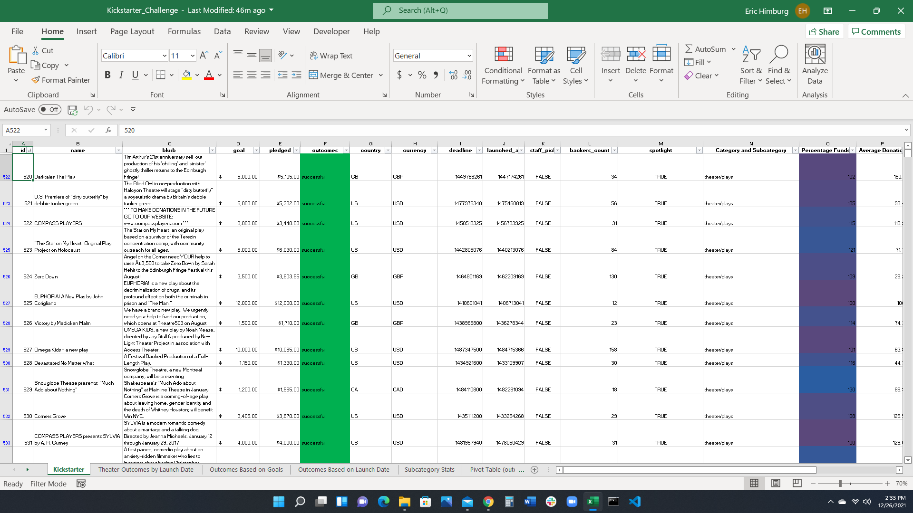

# An Analysis of Kickstarter Play Campaigns
## Introduction
In order to determine the best options for a successful theater campaign, Kickstarter data from years 2009 through 2017 was filtered and analyzed.  Initially, the data of all Kickstarter efforts were aggregated and then filtered to look at theatrical efforts, specifically plays.  Then the data was sorted by month and funding goals to see if the start date or the amount of funding required for the production affected its success.    
## Analysis and Challenges
Kickstarter data was downloaded into an EXCEL spreadsheet.  Numerical data was turned into monetary values or dates as required, with some rounding and calculations needed to determine averages.  Dates were converted from Unix timestamps into a more standard format.  Categories of funding were separated into subcategories so that the data could be sorted to view data from plays as opposed to data from unrelated areas such as food trucks.  Once the data was filtered into plays, the outcome of all plays were plotted by funding goals and launch dates. This was done by making a pivot chart and a line graph.

A picture of the filtered data can be seen below.  There were three main challenges when working with this data.  First, all of the dates such as the funding deadline were intially a Unix timestamp.  This needed to be converted into a standard date format.  Second, the categories and subcategories of all the different Kickstarter campaign were compiled in the same column.  It was necessary to separate each one of these into a category and subcategory.  Third, some the plays did not have any backers.  This led to division by zero errors when calculating the average donor donation.  It was necessary to change these from errors to zero amounts.

A picture of the 

## Results
Put results here

